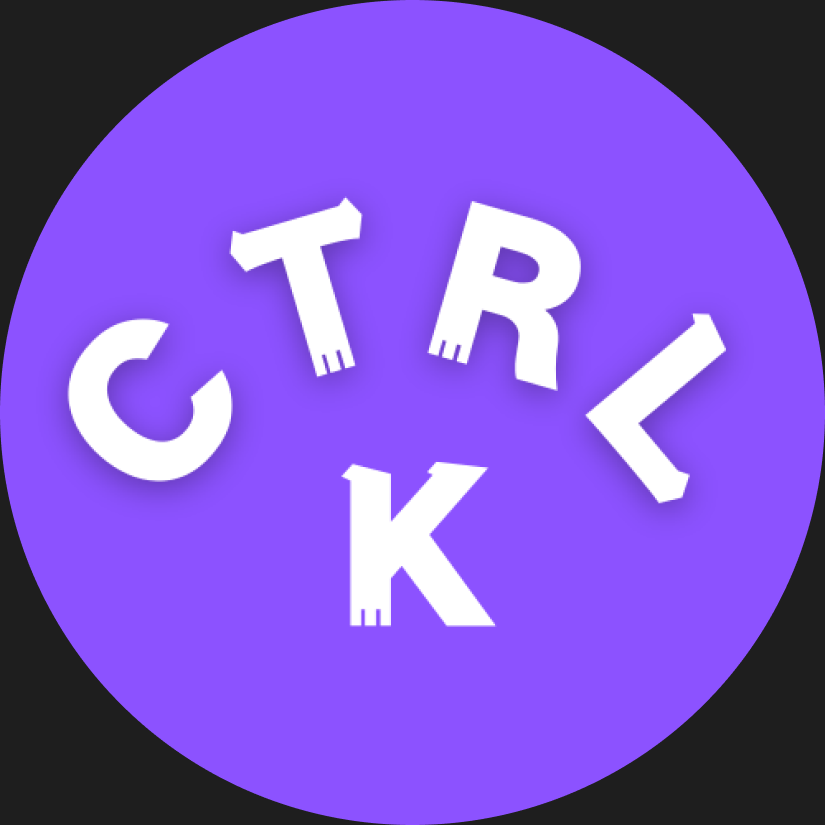

# CtrlK - Quick Search Browser Extension

<div align="center">
  
  
  <p><strong>An elegant Chrome browser extension that allows you to quickly search and access bookmarks and tabs using the Ctrl+K shortcut</strong></p>

  [](package.json)
  [](LICENSE)
  [](https://chrome.google.com/webstore)
</div>

## ✨ Features

### 🔍 Smart Search
- **Real-time Search**: Display search results instantly as you type
- **Multi-source Search**: Search through bookmarks and currently open tabs simultaneously
- **Fuzzy Matching**: Support fuzzy search without needing to type complete titles
- **Smart Scoring**: Sort search results based on relevance

### ⚡ Quick Access
- **Keyboard Shortcuts**: 
  - Windows/Linux: `Ctrl + K`
  - macOS: `Command + K`
- **One-click Open**: Click search results to quickly navigate to the corresponding page
- **Tab Switching**: Quickly switch to already opened tabs
- **Bookmark Access**: Open bookmarks in new tabs

### 🎨 Elegant Interface
- **Modern Design**: Modern interface built with React + Tailwind CSS
- **Responsive Layout**: Adapts to different screen sizes
- **Icon Display**: Shows website icons for quick identification
- **Grouped Display**: Tabs and bookmarks are displayed in groups for clarity

### 🔧 Technical Features
- **Debounced Search**: 300ms debounce mechanism improves search performance
- **Modal Dialog**: Floating search panel that doesn't interfere with current page
- **Keyboard Navigation**: Support arrow key navigation through search results
- **Auto Focus**: Automatically focus search box when panel opens

## 🚀 Quick Start

### Installation

#### Method 1: Chrome Web Store (Recommended)
1. Visit the [Chrome Web Store](https://chrome.google.com/webstore)
2. Search for "CtrlK"
3. Click "Add to Chrome"

#### Method 2: Developer Mode Installation
1. Download or clone this repository
2. Run `pnpm install` to install dependencies
3. Run `pnpm run build` to build the extension
4. Open Chrome browser and navigate to `chrome://extensions/`
5. Enable "Developer mode"
6. Click "Load unpacked extension"
7. Select the `dist` folder from the project

### Usage

1. **Open Search Panel**
   - Press `Ctrl + K` (Windows/Linux) or `Command + K` (macOS)
   - Or click the CtrlK icon in the browser toolbar

2. **Search Content**
   - Type keywords in the search box
   - The system will display matching bookmarks and tabs in real-time

3. **Select Results**
   - Click search results with mouse
   - Or use arrow keys to navigate and press Enter to confirm

4. **Quick Access**
   - Tabs: Directly switch to that tab
   - Bookmarks: Open bookmark link in a new tab

## 🛠️ Tech Stack

### Frontend Technologies
- **React 19**: Modern UI framework
- **TypeScript**: Type-safe JavaScript
- **Tailwind CSS 4**: Utility-first CSS framework
- **Vite**: Fast build tool
- **cmdk**: Command palette component library

### UI Components
- **Radix UI**: Unstyled, accessible UI components
- **Lucide React**: Beautiful icon library
- **Class Variance Authority**: CSS class variant management

### Search Engine
- **Fuse.js**: Lightweight fuzzy search library
- **RxJS**: Reactive programming library for handling async operations

### Browser Extension
- **Chrome Extension Manifest V3**: Latest extension specification
- **Chrome APIs**: tabs, bookmarks, commands, and other APIs

## 🔧 Development Guide

### Requirements
- Node.js >= 16
- pnpm >= 7

### Development Workflow

1. **Clone Repository**
   ```bash
   git clone https://github.com/zhaogongchengsi/ctrlk.git
   cd ctrlk
   ```

2. **Install Dependencies**
   ```bash
   pnpm install
   ```

3. **Development Mode**
   ```bash
   pnpm run dev
   ```

4. **Build Project**
   ```bash
   pnpm run build
   ```

5. **Code Linting**
   ```bash
   pnpm run lint
   ```

### Build Instructions
- `pnpm run build:client`: Build frontend application
- `pnpm run build:main`: Build extension scripts
- `pnpm run build`: Complete build

## 🎯 Core Feature Implementation

### Search Algorithm
Uses Fuse.js for fuzzy search implementation:
- Support fuzzy matching of titles and URLs
- Configurable similarity threshold
- Smart scoring and sorting

### Keyboard Shortcut Handling
Implemented through Chrome Commands API:
- Cross-platform keyboard shortcut support
- Global shortcut key listening
- Conflict detection and handling

### Data Source Management
- **Tabs**: Get currently open tabs through Chrome Tabs API
- **Bookmarks**: Get user bookmarks through Chrome Bookmarks API
- **Real-time Sync**: Monitor tab and bookmark changes to keep data current

### UI Interactions
- **Modal Dialog**: Floating panel implemented using iframe
- **Keyboard Navigation**: Support arrow keys and Enter key operations
- **Auto-complete**: Real-time search suggestions and result preview

## 🔒 Permissions

The extension requires the following permissions:

- **tabs**: Get and switch tabs
- **bookmarks**: Read user bookmarks
- **commands**: Register keyboard shortcuts
- **windows**: Window management

All permissions are used only for core functionality. No user data is collected or uploaded.

## 🤝 Contributing

Contributions are welcome! Please follow these steps:

1. Fork this repository
2. Create a feature branch (`git checkout -b feature/amazing-feature`)
3. Commit your changes (`git commit -m 'Add some amazing feature'`)
4. Push to the branch (`git push origin feature/amazing-feature`)
5. Create a Pull Request

### Contribution Guidelines
- Follow TypeScript and ESLint standards
- Run tests and code checks before committing
- Write clear commit messages
- Update relevant documentation

## 📝 Changelog

### v0.0.1 (2024-08-27)
- 🎉 Initial release
- ✨ Implement basic search functionality
- 🔍 Support bookmark and tab search
- ⚡ Add keyboard shortcut support
- 🎨 Implement modern UI interface

## 📄 License

This project is licensed under the MIT License - see the [LICENSE](LICENSE) file for details.

## 🙏 Acknowledgments

- [cmdk](https://github.com/pacocoursey/cmdk) - Excellent command palette component
- [Fuse.js](https://github.com/krisk/Fuse) - Powerful fuzzy search library
- [Radix UI](https://github.com/radix-ui/primitives) - High-quality UI components
- [Tailwind CSS](https://github.com/tailwindlabs/tailwindcss) - Utility-first CSS framework

## 📞 Contact

- Author: [zhaogongchengsi](https://github.com/zhaogongchengsi)
- Issue Reports: [GitHub Issues](https://github.com/zhaogongchengsi/ctrlk/issues)

---

<div align="center">
  <p>If this project helps you, please give it a ⭐ Star!</p>
</div>
